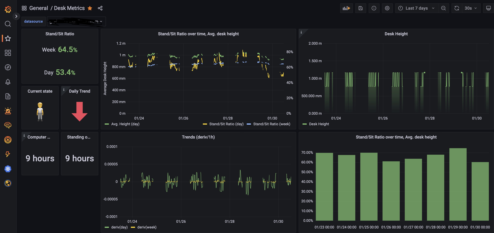

# jarvis_exporter

A Prometheus exporter for the Fully Jarvis standing desk. With a bit of simple custom hardware, it can export the desk's current height, as a Prometheus metric!

Based on the excellent reverse-engineering done by @phord at https://github.com/phord/Jarvis.

[Docker Images available](https://hub.docker.com/r/hairyhenderson/jarvis_exporter) for Linux on x86-64, arm64, armv7 (Raspberry Pi), and armv6 (Pi Zero) platforms.

Can be used to create Grafana dashboards like this:

## Hardware

_A description of the hardware I've put together is coming soon, but for now see
[this discussion](https://github.com/phord/Jarvis/discussions/8) for some hints!_

## TODO

- [ ] Support multiple UARTs for reading from both handset & desk (probably on a Raspberry Pi)

## License

[The MIT License](http://opensource.org/licenses/MIT)

Copyright (c) 2021 Dave Henderson
